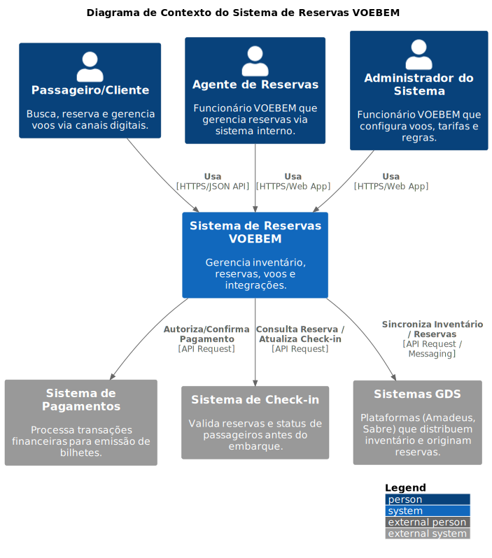

# 1. Arquitetura do Sistema - Diagrama C4

Para ilustrar claramente a arquitetura proposta para o Sistema VOEBEM, utilizamos a metodologia C4 Model. Esta abordagem fornece diferentes níveis de detalhe, desde uma visão geral do contexto até a estrutura interna dos componentes principais, facilitando a compreensão por diferentes públicos (técnicos e de negócio).

*   **Nível 1 (Contexto):**
    *Este diagrama mostra o Sistema de Reservas VOEBEM em seu contexto, identificando os principais usuários e as integrações com sistemas externos essenciais para sua operação.*

    

    *   **Usuários (Personas):**
        *   **Passageiro/Cliente:** Pessoa que busca, reserva e gerencia voos através dos canais digitais (Website/App Mobile).
        *   **Agente de Reservas (Funcionário VOEBEM):** Funcionário que utiliza o sistema internamente para criar, modificar e gerenciar reservas em nome dos clientes.
        *   **Administrador do Sistema (Funcionário VOEBEM):** Funcionário responsável pela configuração de voos, tarifas, regras de negócio e gerenciamento geral do sistema.

    *   **Sistema Principal:**
        *   **Sistema de Reservas VOEBEM (Software System):** A aplicação central que gerencia todo o inventário de voos, trechos, assentos, processa reservas e fornece informações aos usuários e sistemas externos.

    *   **Sistemas Externos:**
        *   **Sistema de Pagamentos (External System):** Serviço externo responsável pelo processamento seguro de transações financeiras para a emissão de bilhetes. *Interage com o Sistema VOEBEM para autorizar e confirmar pagamentos.*
        *   **Sistema de Check-in (External System):** Sistema utilizado nos aeroportos (ou online) para validar reservas, confirmar a presença do passageiro e atribuir/confirmar assentos antes do embarque. *Interage com o Sistema VOEBEM para consultar dados da reserva/assento e atualizar o status de check-in.*
        *   **Sistemas GDS (Global Distribution Systems) (External System):** Plataformas globais (Exemplo: Amadeus, Sabre) que distribuem o inventário de voos da VOEBEM para agências de viagens e outros canais. *Interage com o Sistema VOEBEM para consultar disponibilidade, criar reservas (originadas externamente) e sincronizar informações.*

*   **Nível 2 (Container):**
    *Este diagrama detalha os principais blocos de construção (containers) do Sistema de Reservas VOEBEM, suas responsabilidades, tecnologias e como eles interagem, utilizando um banco de dados centralizado conforme requisito.*

    

    **Containers Principais:**

    *   **Web App (SPA) (Container):**
        *   **Descrição:** Interface web principal acessada via navegador.
        *   **Tecnologia:** React.
        *   **Responsabilidade:** Fornecer a interface do usuário para Passageiros, Agentes de Reservas e Administradores realizarem suas tarefas (consultas, reservas, gerenciamento).
        *   **Interage com:** API Gateway (via HTTPS/JSON).

    *   **Mobile App (Container):**
        *   **Descrição:** Aplicativo móvel nativo ou híbrido.
        *   **Tecnologia:** React Native / Nativo (iOS/Android).
        *   **Responsabilidade:** Fornecer uma interface otimizada para Passageiros em dispositivos móveis.
        *   **Interage com:** API Gateway (via HTTPS/JSON).

    *   **API Gateway (Container):**
        *   **Descrição:** Ponto único de entrada para todas as requisições externas das interfaces (SPA, Mobile App) e de sistemas externos (Check-in).
        *   **Tecnologia:** Exemplo: AWS API Gateway, Nginx, Kong.
        *   **Responsabilidade:** Roteamento de requisições para os serviços backend apropriados, autenticação/autorização inicial, aplicação de rate limiting, agregação leve de respostas (opcional).
        *   **Interage com:** Web App, Mobile App, Sistema de Check-in, API de Reservas, API de Voos.

    *   **API de Reservas (Container):**
        *   **Descrição:** Microsserviço backend focado no domínio de reservas.
        *   **Tecnologia:** Java / Spring Boot.
        *   **Responsabilidade:** Gerenciar todo o ciclo de vida das reservas (criação, consulta, cancelamento, prorrogação), dados de passageiros, orquestrar interações com pagamento, GDS e check-in, gerenciar reserva de assentos.
        *   **Interage com:** API Gateway, Banco de Dados Central, API de Voos, Cache, Sistema de Mensageria, Sistema de Pagamentos, Sistemas GDS.

    *   **API de Voos (Container):**
        *   **Descrição:** Microsserviço backend focado no domínio de inventário de voos.
        *   **Tecnologia:** Python / Django.
        *   **Responsabilidade:** Gerenciar informações sobre voos, trechos, horários, aeroportos, aeronaves e calcular/consultar disponibilidade de voos e assentos.
        *   **Interage com:** API Gateway, Banco de Dados Central, Cache, API de Reservas.

    *   **Serviço de Notificação (Container):**
        *   **Descrição:** Serviço assíncrono para envio de notificações.
        *   **Tecnologia:** Node.js.
        *   **Responsabilidade:** Consumir eventos do Sistema de Mensageria (Exemplo: `ReservaConfirmada`, `PrazoExpirando`) e enviar notificações aos usuários via canais apropriados (Email, SMS - integração com serviços externos específicos não mostrada neste nível).
        *   **Interage com:** Sistema de Mensageria.

    **Containers de Dados e Mensageria:**

    *   **Banco de Dados Central (Database Container):**
        *   **Descrição:** Banco de dados relacional centralizado que armazena todos os dados da aplicação.
        *   **Tecnologia:** PostgreSQL.
        *   **Responsabilidade:** Armazenar de forma persistente e transacional os dados de reservas, passageiros, voos, trechos, aeroportos, aeronaves, assentos, etc.
        *   **Acessado por:** API de Reservas, API de Voos.

    *   **Cache (Database Container):**
        *   **Descrição:** Armazenamento de dados em memória para acesso rápido.
        *   **Tecnologia:** Redis.
        *   **Responsabilidade:** Acelerar consultas frequentes (Exemplo: disponibilidade de voos/assentos), armazenar dados de sessão (opcional), gerenciar locks temporários (Exemplo: durante seleção de assento).
        *   **Acessado por:** API de Reservas, API de Voos.

    *   **Sistema de Mensageria (Container):**
        *   **Descrição:** Broker de mensagens para comunicação assíncrona.
        *   **Tecnologia:** RabbitMQ.
        *   **Responsabilidade:** Desacoplar a comunicação entre serviços, permitindo que eventos sejam publicados (pela API de Reservas) e consumidos (pelo Serviço de Notificação) de forma independente e resiliente.
        *   **Acessado por:** API de Reservas, Serviço de Notificação.

*   **Nível 3 (Componentes - Exemplo para API de Reservas):**
    *Este diagrama detalha a estrutura interna do container "API de Reservas", mostrando seus principais componentes lógicos e como eles colaboram para realizar as funcionalidades de reserva e interagir com dependências externas.*

    

    **Componentes Principais da API de Reservas:**

    *   **Controllers (`ReservationController`, `PassengerController`, `CheckinDataController`):**
        *   **Tecnologia:** Spring MVC RestController.
        *   **Responsabilidade:** Receber requisições HTTP da API Gateway, validar entradas básicas e delegar para os serviços apropriados. O `CheckinDataController` expõe endpoints específicos para consulta pelo Sistema de Check-in.

    *   **Services (`ReservationService`, `SeatManagementService`, `PaymentIntegrationService`, `GdsIntegrationService`, `CheckinDataService`):**
        *   **Tecnologia:** Spring Service.
        *   **Responsabilidade:** Contêm a lógica de negócio principal.
            *   `ReservationService`: Orquestra o fluxo de criação, consulta, atualização de reservas, validações de regras de negócio.
            *   `SeatManagementService`: Gerencia a lógica de seleção, bloqueio temporário (usando cache) e confirmação de assentos.
            *   `PaymentIntegrationService`: Coordena a comunicação com o `PaymentGatewayClient` para processar pagamentos.
            *   `GdsIntegrationService`: Lida com a lógica de receber/enviar dados de/para os `Sistemas GDS` através do `GdsApiClient`.
            *   `CheckinDataService`: Fornece dados consolidados e validados sobre a reserva e assento para o `CheckinDataController`.

    *   **Repositories (`ReservationRepository`, `PassengerRepository`, `ReservedSeatRepository`):**
        *   **Tecnologia:** Spring Data JPA Repository.
        *   **Responsabilidade:** Abstrair o acesso (leitura/escrita) aos dados das entidades correspondentes no `Banco de Dados Central`.

    *   **Clients (`FlightApiClient`, `PaymentGatewayClient`, `GdsApiClient`):**
        *   **Tecnologia:** Feign Client / RestTemplate / SDKs específicos.
        *   **Responsabilidade:** Encapsular a comunicação via rede com outros containers ou sistemas externos.
            *   `FlightApiClient`: Comunica-se com a `API de Voos` para obter informações de voos, trechos e validar disponibilidade/assentos.
            *   `PaymentGatewayClient`: Interage com o `Sistema de Pagamentos` externo.
            *   `GdsApiClient`: Interage com os `Sistemas GDS` externos.

    *   **Messaging (`ReservationEventPublisher`):**
        *   **Tecnologia:** Spring AMQP Template.
        *   **Responsabilidade:** Publicar eventos de domínio significativos (Exemplo: `ReservaConfirmada`, `PagamentoFalhou`) no `Sistema de Mensageria` para processamento assíncrono (Exemplo: notificações).

    *   **Caching (`SeatAvailabilityCache`):**
        *   **Tecnologia:** Spring Data Redis.
        *   **Responsabilidade:** Interagir com o `Cache (Redis)` para operações específicas, como gerenciamento de locks distribuídos durante a seleção de assentos para evitar concorrência.

**Destaques Obrigatórios:**
*   **Escalabilidade:**
    *   **Horizontal:** Utilização de múltiplos containers/instâncias para os serviços (Frontend, API Gateway, Serviços Backend) gerenciados por orquestradores (Kubernetes, AWS ECS) ou grupos de autoescalonamento (Auto Scaling Groups). O Banco de Dados pode escalar leituras com réplicas.
    *   **Vertical:** Aumento de recursos (CPU/Memória) das instâncias/containers conforme necessário (menos preferível para serviços stateless).
*   **Balanceamento de Carga:** Uso de Load Balancers (Exemplo: AWS ELB, Nginx) na frente da API Gateway e dos serviços backend para distribuir o tráfego entre as instâncias disponíveis.
*   **Alta Disponibilidade:**
    *   Deploy das instâncias/containers em múltiplas Zonas de Disponibilidade (AZs) na nuvem.
    *   Uso de bancos de dados gerenciados com replicação multi-AZ e failover automático.
    *   Implementação de Health Checks para que o Load Balancer e o orquestrador removam instâncias não saudáveis.
