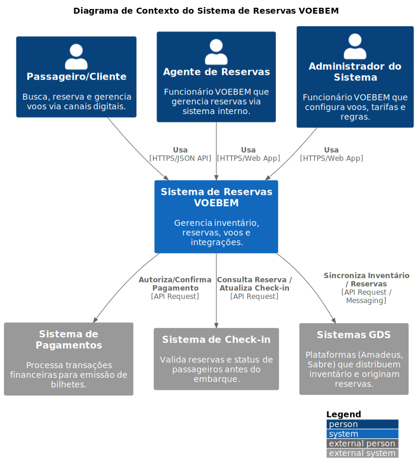
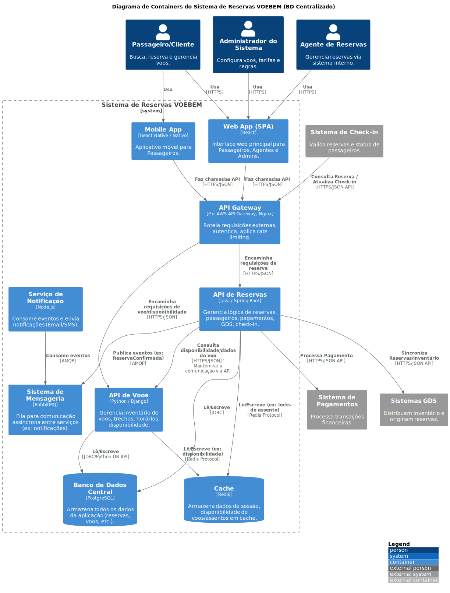
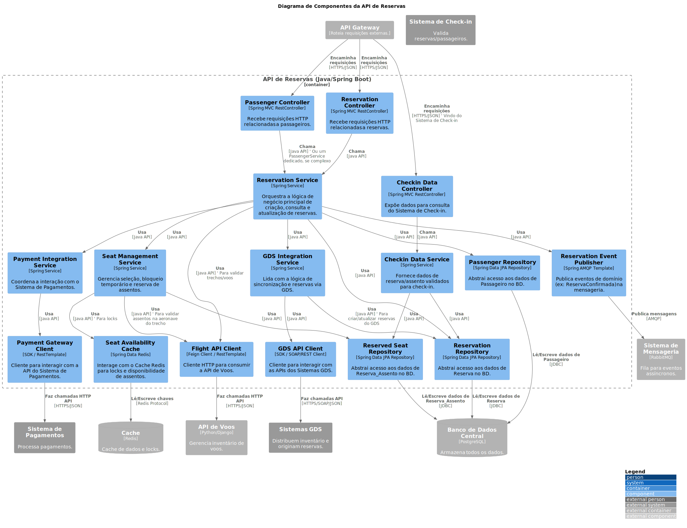
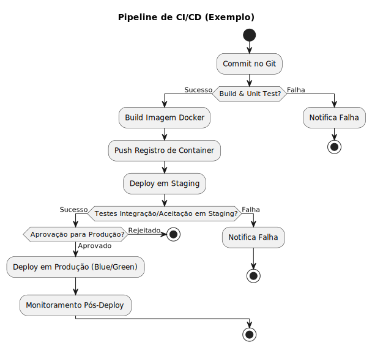
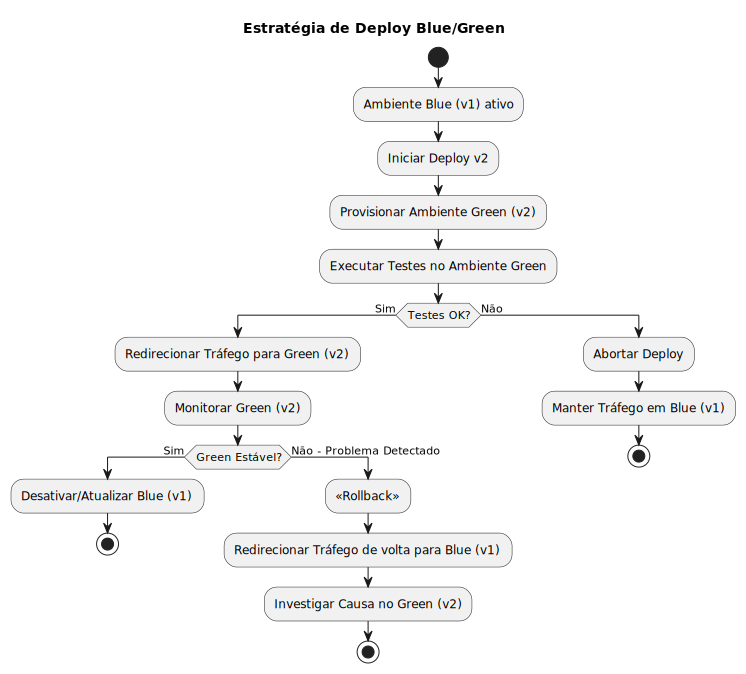
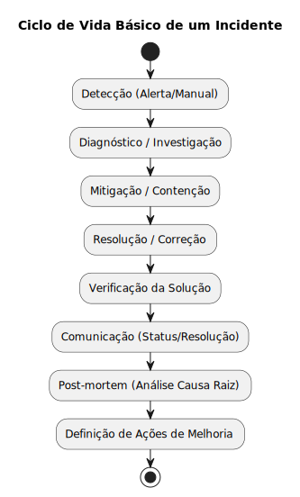
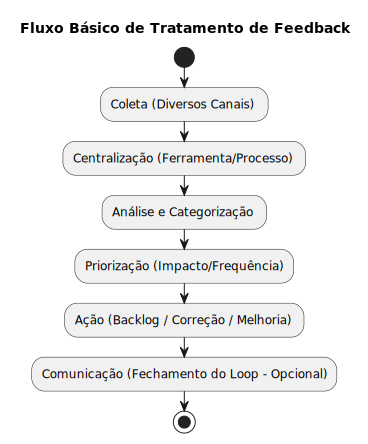
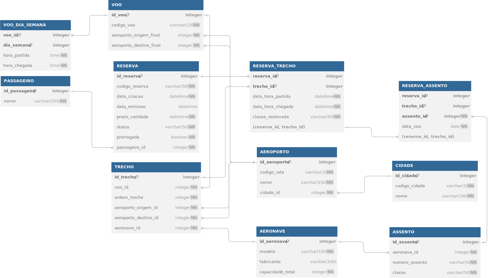

PONTIFÍCIA UNIVERSIDADE CATÓLICA DE MINAS GERAIS
PUC Minas Virtual


**ATIVIDADE DE NIVELAMENTO**


# Proposta de Solução para o Sistema VOEBEM


**Aluno:** Frederyck Baleeiro Espinheiro Sales

Castanhal - PA
Abril de 2025


---


Sumário

NIVELAMENTO SRE
1. Arquitetura do Sistema - Diagrama C4
2. Estratégia de Deploy e Resiliência
3. Plano de Melhoria da Confiabilidade e Percepção do Cliente

 
# 1. Arquitetura do Sistema - Diagrama C4

Para ilustrar claramente a arquitetura proposta para o Sistema VOEBEM, utilizamos a metodologia C4 Model. Esta abordagem fornece diferentes níveis de detalhe, desde uma visão geral do contexto até a estrutura interna dos componentes principais, facilitando a compreensão por diferentes públicos (técnicos e de negócio).

*   **Nível 1 (Contexto):**
    *Este diagrama mostra o Sistema de Reservas VOEBEM em seu contexto, identificando os principais usuários e as integrações com sistemas externos essenciais para sua operação.*

    

    *   **Usuários (Personas):**
        *   **Passageiro/Cliente:** Pessoa que busca, reserva e gerencia voos através dos canais digitais (Website/App Mobile).
        *   **Agente de Reservas (Funcionário VOEBEM):** Funcionário que utiliza o sistema internamente para criar, modificar e gerenciar reservas em nome dos clientes.
        *   **Administrador do Sistema (Funcionário VOEBEM):** Funcionário responsável pela configuração de voos, tarifas, regras de negócio e gerenciamento geral do sistema.

    *   **Sistema Principal:**
        *   **Sistema de Reservas VOEBEM (Software System):** A aplicação central que gerencia todo o inventário de voos, trechos, assentos, processa reservas e fornece informações aos usuários e sistemas externos.

    *   **Sistemas Externos:**
        *   **Sistema de Pagamentos (External System):** Serviço externo responsável pelo processamento seguro de transações financeiras para a emissão de bilhetes. *Interage com o Sistema VOEBEM para autorizar e confirmar pagamentos.*
        *   **Sistema de Check-in (External System):** Sistema utilizado nos aeroportos (ou online) para validar reservas, confirmar a presença do passageiro e atribuir/confirmar assentos antes do embarque. *Interage com o Sistema VOEBEM para consultar dados da reserva/assento e atualizar o status de check-in.*
        *   **Sistemas GDS (Global Distribution Systems) (External System):** Plataformas globais (Exemplo: Amadeus, Sabre) que distribuem o inventário de voos da VOEBEM para agências de viagens e outros canais. *Interage com o Sistema VOEBEM para consultar disponibilidade, criar reservas (originadas externamente) e sincronizar informações.*

*   **Nível 2 (Container):**
    *Este diagrama detalha os principais blocos de construção (containers) do Sistema de Reservas VOEBEM, suas responsabilidades, tecnologias e como eles interagem, utilizando um banco de dados centralizado conforme requisito.*

    

    **Containers Principais:**

    *   **Web App (SPA) (Container):**
        *   **Descrição:** Interface web principal acessada via navegador.
        *   **Tecnologia:** React.
        *   **Responsabilidade:** Fornecer a interface do usuário para Passageiros, Agentes de Reservas e Administradores realizarem suas tarefas (consultas, reservas, gerenciamento).
        *   **Interage com:** API Gateway (via HTTPS/JSON).

    *   **Mobile App (Container):**
        *   **Descrição:** Aplicativo móvel nativo ou híbrido.
        *   **Tecnologia:** React Native / Nativo (iOS/Android).
        *   **Responsabilidade:** Fornecer uma interface otimizada para Passageiros em dispositivos móveis.
        *   **Interage com:** API Gateway (via HTTPS/JSON).

    *   **API Gateway (Container):**
        *   **Descrição:** Ponto único de entrada para todas as requisições externas das interfaces (SPA, Mobile App) e de sistemas externos (Check-in).
        *   **Tecnologia:** Exemplo: AWS API Gateway, Nginx, Kong.
        *   **Responsabilidade:** Roteamento de requisições para os serviços backend apropriados, autenticação/autorização inicial, aplicação de rate limiting, agregação leve de respostas (opcional).
        *   **Interage com:** Web App, Mobile App, Sistema de Check-in, API de Reservas, API de Voos.

    *   **API de Reservas (Container):**
        *   **Descrição:** Microsserviço backend focado no domínio de reservas.
        *   **Tecnologia:** Java / Spring Boot.
        *   **Responsabilidade:** Gerenciar todo o ciclo de vida das reservas (criação, consulta, cancelamento, prorrogação), dados de passageiros, orquestrar interações com pagamento, GDS e check-in, gerenciar reserva de assentos.
        *   **Interage com:** API Gateway, Banco de Dados Central, API de Voos, Cache, Sistema de Mensageria, Sistema de Pagamentos, Sistemas GDS.

    *   **API de Voos (Container):**
        *   **Descrição:** Microsserviço backend focado no domínio de inventário de voos.
        *   **Tecnologia:** Python / Django.
        *   **Responsabilidade:** Gerenciar informações sobre voos, trechos, horários, aeroportos, aeronaves e calcular/consultar disponibilidade de voos e assentos.
        *   **Interage com:** API Gateway, Banco de Dados Central, Cache, API de Reservas.

    *   **Serviço de Notificação (Container):**
        *   **Descrição:** Serviço assíncrono para envio de notificações.
        *   **Tecnologia:** Node.js.
        *   **Responsabilidade:** Consumir eventos do Sistema de Mensageria (Exemplo: `ReservaConfirmada`, `PrazoExpirando`) e enviar notificações aos usuários via canais apropriados (Email, SMS - integração com serviços externos específicos não mostrada neste nível).
        *   **Interage com:** Sistema de Mensageria.

    **Containers de Dados e Mensageria:**

    *   **Banco de Dados Central (Database Container):**
        *   **Descrição:** Banco de dados relacional centralizado que armazena todos os dados da aplicação.
        *   **Tecnologia:** PostgreSQL.
        *   **Responsabilidade:** Armazenar de forma persistente e transacional os dados de reservas, passageiros, voos, trechos, aeroportos, aeronaves, assentos, etc.
        *   **Acessado por:** API de Reservas, API de Voos.

    *   **Cache (Database Container):**
        *   **Descrição:** Armazenamento de dados em memória para acesso rápido.
        *   **Tecnologia:** Redis.
        *   **Responsabilidade:** Acelerar consultas frequentes (Exemplo: disponibilidade de voos/assentos), armazenar dados de sessão (opcional), gerenciar locks temporários (Exemplo: durante seleção de assento).
        *   **Acessado por:** API de Reservas, API de Voos.

    *   **Sistema de Mensageria (Container):**
        *   **Descrição:** Broker de mensagens para comunicação assíncrona.
        *   **Tecnologia:** RabbitMQ.
        *   **Responsabilidade:** Desacoplar a comunicação entre serviços, permitindo que eventos sejam publicados (pela API de Reservas) e consumidos (pelo Serviço de Notificação) de forma independente e resiliente.
        *   **Acessado por:** API de Reservas, Serviço de Notificação.

*   **Nível 3 (Componentes - Exemplo para API de Reservas):**
    *Este diagrama detalha a estrutura interna do container "API de Reservas", mostrando seus principais componentes lógicos e como eles colaboram para realizar as funcionalidades de reserva e interagir com dependências externas.*

    

    **Componentes Principais da API de Reservas:**

    *   **Controllers (`ReservationController`, `PassengerController`, `CheckinDataController`):**
        *   **Tecnologia:** Spring MVC RestController.
        *   **Responsabilidade:** Receber requisições HTTP da API Gateway, validar entradas básicas e delegar para os serviços apropriados. O `CheckinDataController` expõe endpoints específicos para consulta pelo Sistema de Check-in.

    *   **Services (`ReservationService`, `SeatManagementService`, `PaymentIntegrationService`, `GdsIntegrationService`, `CheckinDataService`):**
        *   **Tecnologia:** Spring Service.
        *   **Responsabilidade:** Contêm a lógica de negócio principal.
            *   `ReservationService`: Orquestra o fluxo de criação, consulta, atualização de reservas, validações de regras de negócio.
            *   `SeatManagementService`: Gerencia a lógica de seleção, bloqueio temporário (usando cache) e confirmação de assentos.
            *   `PaymentIntegrationService`: Coordena a comunicação com o `PaymentGatewayClient` para processar pagamentos.
            *   `GdsIntegrationService`: Lida com a lógica de receber/enviar dados de/para os `Sistemas GDS` através do `GdsApiClient`.
            *   `CheckinDataService`: Fornece dados consolidados e validados sobre a reserva e assento para o `CheckinDataController`.

    *   **Repositories (`ReservationRepository`, `PassengerRepository`, `ReservedSeatRepository`):**
        *   **Tecnologia:** Spring Data JPA Repository.
        *   **Responsabilidade:** Abstrair o acesso (leitura/escrita) aos dados das entidades correspondentes no `Banco de Dados Central`.

    *   **Clients (`FlightApiClient`, `PaymentGatewayClient`, `GdsApiClient`):**
        *   **Tecnologia:** Feign Client / RestTemplate / SDKs específicos.
        *   **Responsabilidade:** Encapsular a comunicação via rede com outros containers ou sistemas externos.
            *   `FlightApiClient`: Comunica-se com a `API de Voos` para obter informações de voos, trechos e validar disponibilidade/assentos.
            *   `PaymentGatewayClient`: Interage com o `Sistema de Pagamentos` externo.
            *   `GdsApiClient`: Interage com os `Sistemas GDS` externos.

    *   **Messaging (`ReservationEventPublisher`):**
        *   **Tecnologia:** Spring AMQP Template.
        *   **Responsabilidade:** Publicar eventos de domínio significativos (Exemplo: `ReservaConfirmada`, `PagamentoFalhou`) no `Sistema de Mensageria` para processamento assíncrono (Exemplo: notificações).

    *   **Caching (`SeatAvailabilityCache`):**
        *   **Tecnologia:** Spring Data Redis.
        *   **Responsabilidade:** Interagir com o `Cache (Redis)` para operações específicas, como gerenciamento de locks distribuídos durante a seleção de assentos para evitar concorrência.

**Destaques Obrigatórios:**
*   **Escalabilidade:**
    *   **Horizontal:** Utilização de múltiplos containers/instâncias para os serviços (Frontend, API Gateway, Serviços Backend) gerenciados por orquestradores (Kubernetes, AWS ECS) ou grupos de autoescalonamento (Auto Scaling Groups). O Banco de Dados pode escalar leituras com réplicas.
    *   **Vertical:** Aumento de recursos (CPU/Memória) das instâncias/containers conforme necessário (menos preferível para serviços stateless).
*   **Balanceamento de Carga:** Uso de Load Balancers (Exemplo: AWS ELB, Nginx) na frente da API Gateway e dos serviços backend para distribuir o tráfego entre as instâncias disponíveis.
*   **Alta Disponibilidade:**
    *   Deploy das instâncias/containers em múltiplas Zonas de Disponibilidade (AZs) na nuvem.
    *   Uso de bancos de dados gerenciados com replicação multi-AZ e failover automático.
    *   Implementação de Health Checks para que o Load Balancer e o orquestrador removam instâncias não saudáveis.


# 2. Estratégia de Deploy e Resiliência

Esta seção detalha as estratégias propostas para garantir entregas de software frequentes, confiáveis e com baixo risco para o Sistema VOEBEM, abordando o pipeline de CI/CD, a metodologia de deploy em produção e o plano de rollback.

## 2.1 Pipeline de CI/CD (Integração Contínua / Entrega Contínua)

Propõe-se um pipeline de CI/CD robusto para automatizar o processo de build, teste e deploy dos diferentes containers (microsserviços, frontend) do sistema, conforme ilustrado abaixo.

*   **Ferramentas Propostas:**
    *   **Controle de Versão:** Git (com repositórios hospedados no GitLab ou GitHub).
    *   **Servidor de CI/CD:** GitLab CI/CD ou GitHub Actions (integrados à plataforma de repositórios).
    *   **Containerização:** Docker (para empacotar as aplicações e suas dependências).
    *   **Registro de Container:** Docker Hub, GitLab Container Registry, AWS ECR ou similar.
    *   **Orquestração de Containers:** Kubernetes (gerenciado na nuvem, Exemplo: AWS EKS, Google GKE, Azure AKS).
    *   **Ferramentas de Teste:** JUnit (para Java/API Reservas), PyTest (para Python/API Voos), Jest/Cypress (para Frontend React).
    *   **Análise de Código (Opcional):** SonarQube (para análise estática de segurança e qualidade).

*   **Fluxo do Pipeline:** O diagrama abaixo ilustra as etapas sequenciais e pontos de decisão do pipeline, desde o commit do código até o deploy em produção, incluindo validações intermediárias.

    

*   **Etapas Detalhadas:**
    1.  **Commit & Trigger:** Desenvolvedor envia código, iniciando o pipeline.
    2.  **Build & Unit Test:** Compilação e testes unitários. Falhas interrompem o pipeline.
    3.  **Code Scan (Opcional):** Análise estática de código.
    4.  **Build da Imagem Docker:** Criação da imagem da aplicação.
    5.  **Push para Registro:** Envio da imagem para o registro.
    6.  **Deploy em Staging:** Implantação em ambiente de homologação.
    7.  **Testes de Integração/Aceitação:** Validação funcional e de integração em Staging. Falhas interrompem o pipeline.
    8.  **Aprovação (Manual/Automática):** Ponto de controle antes da produção.
    9.  **Deploy em Produção:** Implantação em produção usando a estratégia Blue/Green.
    10. **Monitoramento Pós-Deploy:** Observação ativa da nova versão em produção.

## 2.2 Estratégia de Deploy

Considerando a criticidade do sistema e a necessidade de minimizar riscos e downtime, a estratégia de deploy recomendada é **Blue/Green Deployment**, cujo fluxo é apresentado no diagrama a seguir.

*   **Justificativa:**
    *   **Zero Downtime:** Transição suave de tráfego.
    *   **Testes em Produção Isolados:** Validação da nova versão sem impacto no usuário.
    *   **Rollback Instantâneo:** Reversão rápida em caso de problemas.
    *   **Simplicidade Conceitual:** Fluxo claro para deploy e rollback.

*   **Funcionamento (Ilustrado no Diagrama):**

    

    1.  **Ambiente Blue Ativo:** Versão atual (v1) recebe o tráfego.
    2.  **Provisionamento Green:** Nova versão (v2) é implantada em um ambiente idêntico (Green).
    3.  **Testes no Green:** Validação da v2 no ambiente Green isolado.
    4.  **Switch de Tráfego:** Se os testes passarem, o tráfego é direcionado para o ambiente Green (v2).
    5.  **Monitoramento do Green:** A v2 é monitorada em produção.
    6.  **Estabilização ou Rollback:** Se a v2 estiver estável, o ambiente Blue (v1) é desativado. Se problemas críticos forem detectados, o tráfego é revertido imediatamente para o Blue (v1) (Rollback).
    7.  **Desativação do Blue:** Após confirmação da estabilidade do Green, o ambiente Blue é liberado.

*   **Benefícios para VOEBEM:** Essa abordagem minimiza o risco de impacto ao usuário durante atualizações e permite reversões imediatas caso surjam problemas inesperados, garantindo assim a continuidade das operações críticas de reserva e a confiança do cliente.

## 2.3 Estratégia de Rollback

A estratégia de rollback é uma parte intrínseca do fluxo Blue/Green, como visualizado no diagrama anterior.

*   **Processo de Rollback (Detalhado):**
    1.  **Detecção de Problema:** Identificação de falha crítica na versão Green (v2) ativa, via monitoramento ou alertas.
    2.  **Acionamento:** Manual pela equipe SRE/Operações ou automático por violação de SLOs.
    3.  **Redirecionamento de Tráfego:** Reconfiguração do Load Balancer/Roteador para enviar 100% do tráfego de volta ao ambiente Blue (v1), que contém a versão estável anterior. Esta é a ação principal e imediata do rollback.
    4.  **Análise de Causa Raiz:** Investigação do problema no ambiente Green (v2), agora isolado.
    5.  **Correção e Novo Deploy:** Após correção, o ciclo de deploy pode ser reiniciado.

*   **Garantias:**
    *   **Velocidade:** MTTR minimizado pela rapidez do redirecionamento.
    *   **Segurança:** Versão estável anterior sempre disponível.
    *   **Consistência:** Processo claro e passível de automação.


# 3. Plano de Melhoria da Confiabilidade e Percepção do Cliente

A confiabilidade e a percepção positiva do cliente são cruciais para o sucesso do VOEBEM. Este plano descreve as práticas de Engenharia de Confiabilidade de Sites (SRE - Site Reliability Engineering) que propomos para alcançar e manter altos níveis de serviço, alinhando a operação técnica com a experiência do cliente.

## 3.1 Monitoramento e Observabilidade

Uma estratégia robusta de monitoramento e observabilidade é fundamental para entender o comportamento do sistema, detectar problemas proativamente e garantir que as metas de negócio sejam atendidas. Propõe-se uma abordagem baseada nos três pilares da observabilidade: métricas, logs e traces.

*   **SLIs (Service Level Indicators) Chave:** Indicadores quantitativos que medem aspectos específicos do serviço. Exemplos para VOEBEM:

    | Categoria      | SLI (Indicador)                                                                 |
    | -------------- | ------------------------------------------------------------------------------- |
    | Disponibilidade| % de requisições bem-sucedidas (HTTP 2xx/3xx) na API Gateway (endpoints chave) |
    | Disponibilidade| % de requisições bem-sucedidas nas APIs (Reservas, Voos)                        |
    | Latência       | Tempo de resposta (p95, p99) para busca de voos na API Gateway                  |
    | Latência       | Tempo de resposta (p95) para criação de reserva na API de Reservas              |
    | Taxa de Erros  | % de requisições com erro (HTTP 5xx) nas APIs (Gateway, Reservas, Voos)         |
    | Taxa de Erros  | Taxa de falhas na integração com Sistema de Pagamentos                          |
    | Taxa de Erros  | Taxa de erros na publicação/consumo de mensagens (Sistema de Mensageria)        |
    | Saturação      | Uso de CPU/Memória dos containers                                               |
    | Saturação      | Uso de conexões do banco de dados                                               |
    | Saturação      | Profundidade da fila no Sistema de Mensageria                                   |

*   **SLOs (Service Level Objectives):** Metas claras e mensuráveis para os SLIs mais críticos, definindo o nível de serviço esperado. Exemplos:

    | SLI Referente                                | Exemplo de SLO (Meta)                               | Janela     |
    | -------------------------------------------- | --------------------------------------------------- | ---------- |
    | Disponibilidade API Gateway (Busca/Reserva)  | >= 99.9% de requisições bem-sucedidas             | Mensal     |
    | Latência Busca de Voos (p95)                 | < 800ms                                             | Contínua   |
    | Latência Criação de Reserva (p95)            | < 1500ms                                            | Contínua   |
    | Taxa de Erros API Reservas (5xx)             | < 0.1%                                              | Mensal     |

    *(Nota: Estes são exemplos iniciais e devem ser refinados com base em dados históricos e necessidades de negócio).*

*   **Ferramentas Propostas:**

    | Pilar          | Ferramenta(s) Proposta(s)                                  | Principal Responsabilidade                                      |
    | -------------- | ---------------------------------------------------------- | --------------------------------------------------------------- |
    | Métricas       | Prometheus + Grafana                                       | Coleta e Visualização de Métricas (SLIs, SLOs, Saúde)           |
    | Logs           | Fluentd/Bit + Loki + Grafana (ou ELK Stack)                | Coleta, Agregação e Consulta de Logs                            |
    | Tracing        | Jaeger + OpenTelemetry + Grafana                           | Coleta e Visualização de Traces Distribuídos                    |
    | Alertas        | Alertmanager + PagerDuty/Opsgenie                          | Definição de Regras de Alerta e Notificação On-Call             |

*   **Alertas:**
    *   Configurados no **Alertmanager** (parte do ecossistema Prometheus).
    *   Baseados principalmente na **violação dos SLOs** (Exemplo: taxa de erro acima do limite por X minutos, latência p99 excedendo o objetivo) ou em **sintomas críticos** (Exemplo: serviço indisponível, erro de acesso ao banco de dados, fila de mensagens crescendo rapidamente, certificados expirando).
    *   Alertas devem ser **acionáveis**, indicando claramente o problema e o impacto potencial.
    *   Direcionamento para a equipe de plantão (on-call) através de ferramentas como **PagerDuty** ou **Opsgenie**, com diferentes níveis de severidade e canais de notificação (Exemplo: chat, telefone).

## 3.2 Automação de Recuperação

Para aumentar a resiliência e reduzir a necessidade de intervenção manual em caso de falhas, propõe-se a implementação de mecanismos de recuperação automática, principalmente aproveitando recursos do Kubernetes e serviços gerenciados na nuvem.

*   **Auto-Healing (Kubernetes):**
    *   **Liveness Probes:** Verificações periódicas configuradas nos Deployments/StatefulSets. Se um container falhar na verificação (Exemplo: travado, não respondendo a um endpoint `/healthz`), o Kubelet o reiniciará automaticamente na mesma instância (Node).
    *   **Readiness Probes:** Verificações que indicam se um container está pronto para receber tráfego (Exemplo: aplicação iniciada, conexões estabelecidas). O Kubernetes só enviará tráfego (via Services) para Pods que estejam "Ready". Se um Pod falhar na Readiness Probe, ele é temporariamente removido do balanceamento de carga até se recuperar.
    *   **ReplicaSets/Deployments:** Garantem que o número desejado de réplicas de um serviço esteja sempre em execução. Se um Node falhar, os Pods que estavam nele são automaticamente reagendados em outros Nodes saudáveis.

*   **Auto-Scaling (Kubernetes):**
    *   **Horizontal Pod Autoscaler (HPA):** Ajusta automaticamente o número de réplicas de um Deployment/StatefulSet com base em métricas observadas, como utilização média de CPU, memória ou métricas customizadas (Exemplo: requisições por segundo, profundidade de fila via KEDA). Isso garante que o sistema tenha capacidade suficiente para lidar com picos de carga e reduza custos em períodos de baixa utilização.
    *   **Cluster Autoscaler (Provedor de Nuvem):** Adiciona ou remove automaticamente Nós (VMs) ao cluster Kubernetes com base na demanda por recursos (Pods pendentes por falta de CPU/memória).

*   **Failover Automático (Componentes Stateful):**
    *   **Banco de Dados Central (PostgreSQL):** Utilizar um serviço de banco de dados gerenciado na nuvem (Exemplo: AWS RDS, Google Cloud SQL, Azure Database for PostgreSQL) configurado em modo **Multi-AZ (Multi-Availability Zone)**. O provedor de nuvem gerencia a replicação síncrona para uma instância standby em outra AZ e realiza o failover automático para a standby em caso de falha da instância primária, com mínima interrupção.
    *   **Cache (Redis):** Utilizar um serviço gerenciado (Exemplo: AWS ElastiCache for Redis, Google Memorystore) com replicação e failover automático habilitados, se disponível e necessário para a criticidade dos dados em cache.

*   **Chaos Engineering (Prática Recomendada):**
    *   Após estabilizar o sistema e implementar as automações, introduzir falhas controladas periodicamente em ambientes de pré-produção (ou até mesmo produção, com cuidado) para validar a eficácia dos mecanismos de auto-healing, auto-scaling e failover.
    *   **Ferramentas:** Chaos Mesh (CNCF), LitmusChaos (CNCF), ou ferramentas específicas do provedor de nuvem.
    *   **Objetivo:** Descobrir fraquezas ocultas na resiliência do sistema antes que elas causem incidentes reais.

## 3.3 Gestão de Incidentes

Mesmo com automação, incidentes ocorrerão. Um processo claro e eficiente de gestão de incidentes é crucial para minimizar o impacto nos usuários e aprender com as falhas.

**Técnicas Chave para Redução de MTTD e MTTR:**

| Foco   | Técnica                     | Descrição/Objetivo                                                                 |
| ------ | --------------------------- | ---------------------------------------------------------------------------------- |
| MTTD   | Alertas Acionáveis          | Garantir que alertas sejam claros, relevantes e indiquem o impacto/causa.          |
| MTTD   | Dashboards Consolidados     | Visualizar rapidamente a saúde dos serviços, SLOs e métricas chave.                |
| MTTD   | Correlação (Métricas/Logs/Traces) | Usar ferramentas de observabilidade para conectar diferentes sinais rapidamente. |
| MTTR   | Runbooks/Playbooks          | Documentar procedimentos passo-a-passo para diagnóstico e mitigação.             |
| MTTR   | Escalas de Plantão (On-Call)| Definir responsabilidades claras e ferramentas de notificação eficientes.         |
| MTTR   | Ferramentas de Comunicação  | Usar canais dedicados (chat) para comunicação focada durante o incidente.         |
| MTTR   | Automação de Mitigação      | Automatizar ações de recuperação para incidentes bem compreendidos (opcional).    |
| MTTR   | Acesso e Permissões         | Garantir que a equipe on-call tenha o acesso necessário e seguro.                  |
| Ambos  | Post-mortems "Blameless"    | Analisar a causa raiz sistêmica e definir ações de melhoria para prevenir recorrência. |

**Ciclo de Vida Básico de um Incidente (Diagrama):**



*   **Redução de MTTD (Mean Time To Detect):**
    *   **Alertas Acionáveis:** Garantir que os alertas configurados (baseados em SLOs e sintomas) sejam claros, relevantes e direcionem para a possível causa ou impacto. Evitar ruído excessivo de alertas não acionáveis.
    *   **Dashboards Consolidados (Grafana):** Manter dashboards que mostrem rapidamente a saúde dos serviços principais, o status dos SLOs e métricas chave, facilitando a identificação visual de anomalias.
    *   **Correlação:** Utilizar as ferramentas de observabilidade (Grafana com Loki/Jaeger/Prometheus) para correlacionar rapidamente métricas, logs e traces durante a investigação inicial.

*   **Redução de MTTR (Mean Time To Recover):**
    *   **Runbooks/Playbooks:** Documentar procedimentos passo-a-passo para diagnosticar e mitigar incidentes comuns ou alertas específicos. Devem ser mantidos atualizados e facilmente acessíveis.
    *   **Escalas de Plantão (On-Call):** Definir escalas de plantão claras, com responsabilidades bem definidas e ferramentas adequadas (PagerDuty/Opsgenie) para notificação e escalonamento.
    *   **Ferramentas de Comunicação:** Utilizar canais dedicados em ferramentas de chat (Slack, Teams) para comunicação focada durante um incidente ("War Room" virtual).
    *   **Automação de Mitigação (Opcional):** Para incidentes muito bem compreendidos, automatizar ações de mitigação (Exemplo: reiniciar um serviço específico, escalar temporariamente um recurso) via scripts ou ferramentas de automação.
    *   **Acesso e Permissões:** Garantir que a equipe on-call tenha o acesso necessário e seguro para investigar e aplicar correções nos ambientes.
    *   **Cultura de Post-mortems "Blameless":**
        *   Realizar análises pós-incidente detalhadas para cada incidente significativo.
        *   Foco em entender a **causa raiz sistêmica** (tecnologia, processo, monitoramento) e não em culpar indivíduos.
        *   Documentar o incidente, a linha do tempo, o impacto, as ações tomadas e, principalmente, as **ações de acompanhamento** (melhorias no código, infraestrutura, monitoramento, runbooks) para prevenir recorrências.

## 3.4 Feedback dos Clientes

A percepção do cliente é a medida final da confiabilidade. Coletar e agir sobre o feedback do cliente é essencial para complementar os dados técnicos de monitoramento.

*   **Canais de Coleta:**

    | Canal                                    | Descrição / Exemplo                                                              |
    | ---------------------------------------- | -------------------------------------------------------------------------------- |
    | Pesquisas In-App/Web                     | Perguntas curtas sobre a experiência após ações chave (reserva, busca).          |
    | Formulários de Contato/Suporte           | Canal direto para reportar problemas ou dificuldades específicas.                |
    | Análise de Chamados de Suporte           | Categorizar e analisar os motivos dos contatos com a equipe de suporte.          |
    | Monitoramento de Redes Sociais/Avaliação | Acompanhar menções à VOEBEM em plataformas públicas (Twitter, Reclame Aqui).     |
    | Pesquisas de Satisfação (NPS/CSAT)       | Medir a satisfação geral e a probabilidade de recomendação periodicamente.       |

*   **Processamento e Ação:**

    **Fluxo Básico de Tratamento de Feedback (Diagrama):**

    

    *   **Centralização:** Agregar o feedback de diferentes canais em uma ferramenta ou processo unificado (Exemplo: um quadro Kanban, uma ferramenta de gestão de feedback).
    *   **Análise e Categorização:** Identificar temas recorrentes, problemas específicos, sugestões de melhoria. Correlacionar reclamações (Exemplo: lentidão) com dados de monitoramento técnico.
    *   **Priorização:** Avaliar o impacto e a frequência dos problemas reportados pelos clientes.
    *   **Integração com Backlog:** Transformar feedback acionável em itens de trabalho (bugs, melhorias) para as equipes de desenvolvimento e SRE.
    *   **Refinamento de SLIs/SLOs:** Usar o feedback para validar se os SLIs/SLOs atuais refletem a experiência real do usuário ou se novos indicadores são necessários (Exemplo: sucesso na conclusão do fluxo de reserva ponta-a-ponta).
    *   **Comunicação (Fechamento do Loop):** Informar aos clientes (quando apropriado e possível) sobre as ações tomadas com base em seus feedbacks, demonstrando que a empresa ouve e age.


# Esquema Entidade-Relacionamento (ER) - Sistema VOEBEM

Este documento descreve a estrutura do banco de dados relacional proposto para o sistema VOEBEM, mostrando as entidades principais, seus atributos e os relacionamentos entre elas.

## Diagrama ER



*(Nota: O diagrama SVG acima representa visualmente o esquema definido abaixo.)*

## Descrição das Entidades e Relacionamentos

### Entidades

#### PASSAGEIRO
Representa uma pessoa que faz uma reserva.
-   `id_passageiro` (INTEGER): Chave primária, auto-incremento.
-   `nome` (VARCHAR): Nome do passageiro, não nulo.

#### RESERVA
Representa uma reserva feita por um passageiro para um ou mais trechos de voo.
-   `id_reserva` (INTEGER): Chave primária, auto-incremento.
-   `codigo_reserva` (VARCHAR): Código único da reserva, não nulo.
-   `data_criacao` (DATETIME): Data e hora de criação da reserva, não nulo (padrão: data/hora atual).
-   `data_emissao` (DATETIME): Data e hora de emissão (confirmação) da reserva, pode ser nulo.
-   `prazo_validade` (DATETIME): Prazo limite para confirmação da reserva, não nulo.
-   `status` (VARCHAR): Status atual da reserva (Ex: Pendente, Confirmada, Cancelada, Emitida), não nulo.
-   `prorrogada` (BOOLEAN): Indica se o prazo de validade foi prorrogado, não nulo (padrão: false).
-   `passageiro_id` (INTEGER): Chave estrangeira referenciando o passageiro que fez a reserva, não nulo.
-   `fonte_reserva` (VARCHAR): Origem da reserva (Ex: Interno, Web, GDS_Amadeus), pode ser nulo.
-   `id_externo_reserva` (VARCHAR): ID da reserva no sistema externo (Ex: GDS PNR), pode ser nulo.
-   `id_transacao_pagamento` (VARCHAR): ID da transação no sistema de pagamento, pode ser nulo.
-   `status_pagamento` (VARCHAR): Status do pagamento (Ex: Pendente, Aprovado, Falhou), pode ser nulo.
-   `valor_pago` (DECIMAL): Valor efetivamente pago pela reserva, pode ser nulo.

#### VOO
Representa um voo como uma sequência de trechos, com origem e destino finais.
-   `id_voo` (INTEGER): Chave primária, auto-incremento.
-   `codigo_voo` (VARCHAR): Código único do voo, não nulo.
-   `aeroporto_origem_final` (INTEGER): Chave estrangeira referenciando o aeroporto de origem final do voo, não nulo.
-   `aeroporto_destino_final` (INTEGER): Chave estrangeira referenciando o aeroporto de destino final do voo, não nulo.

#### TRECHO
Representa um segmento individual de um voo, conectando dois aeroportos com uma aeronave específica.
-   `id_trecho` (INTEGER): Chave primária, auto-incremento.
-   `voo_id` (INTEGER): Chave estrangeira referenciando o voo ao qual este trecho pertence, não nulo.
-   `ordem_trecho` (INTEGER): Ordem do trecho dentro do voo, não nulo (compõe chave única com `voo_id`).
-   `aeroporto_origem_id` (INTEGER): Chave estrangeira referenciando o aeroporto de origem deste trecho, não nulo.
-   `aeroporto_destino_id` (INTEGER): Chave estrangeira referenciando o aeroporto de destino deste trecho, não nulo.
-   `aeronave_id` (INTEGER): Chave estrangeira referenciando a aeronave usada neste trecho, não nulo.

#### VOO_DIA_SEMANA
Indica em quais dias da semana um voo específico opera e seus horários.
-   `voo_id` (INTEGER): Chave primária composta, chave estrangeira referenciando o voo.
-   `dia_semana` (INTEGER): Chave primária composta, dia da semana (0=Domingo, 6=Sábado).
-   `hora_partida` (TIME): Hora de partida neste dia da semana, não nulo.
-   `hora_chegada` (TIME): Hora de chegada neste dia da semana, não nulo.

#### CIDADE
Representa uma cidade.
-   `id_cidade` (INTEGER): Chave primária, auto-incremento.
-   `codigo_cidade` (VARCHAR): Código único da cidade (Ex: SAO), não nulo.
-   `nome` (VARCHAR): Nome da cidade, não nulo.

#### AEROPORTO
Representa um aeroporto.
-   `id_aeroporto` (INTEGER): Chave primária, auto-incremento.
-   `codigo_iata` (VARCHAR): Código IATA único do aeroporto (Ex: GRU), não nulo.
-   `nome` (VARCHAR): Nome do aeroporto, não nulo.
-   `cidade_id` (INTEGER): Chave estrangeira referenciando a cidade onde o aeroporto está localizado, não nulo.

#### AERONAVE
Representa uma aeronave.
-   `id_aeronave` (INTEGER): Chave primária, auto-incremento.
-   `modelo` (VARCHAR): Modelo da aeronave, não nulo.
-   `fabricante` (VARCHAR): Fabricante da aeronave.
-   `capacidade_total` (INTEGER): Capacidade total de passageiros da aeronave, não nulo.

#### ASSENTO
Representa um assento individual em uma aeronave.
-   `id_assento` (INTEGER): Chave primária, auto-incremento.
-   `aeronave_id` (INTEGER): Chave estrangeira referenciando a aeronave à qual o assento pertence, não nulo.
-   `numero_assento` (VARCHAR): Número/identificação do assento (compõe chave única com `aeronave_id`), não nulo.
-   `classe` (VARCHAR): Classe do assento (Ex: Econômica, Executiva), não nulo.

#### RESERVA_TRECHO
Tabela associativa que liga uma RESERVA a um TRECHO específico que faz parte dessa reserva.
-   `reserva_id` (INTEGER): Parte da chave primária composta, chave estrangeira referenciando a RESERVA.
-   `trecho_id` (INTEGER): Parte da chave primária composta, chave estrangeira referenciando o TRECHO.
-   `data_hora_partida` (DATETIME): Data e hora de partida programada para este trecho na reserva, não nulo.
-   `data_hora_chegada` (DATETIME): Data e hora de chegada programada para este trecho na reserva, não nulo.
-   `classe_reservada` (VARCHAR): Classe em que o assento foi reservado para este trecho, não nulo.

#### RESERVA_ASSENTO
Tabela associativa que liga um `RESERVA_TRECHO` a um `ASSENTO` específico reservado para uma data de voo particular.
-   `reserva_id` (INTEGER): Parte da chave primária composta, chave estrangeira referenciando `RESERVA_TRECHO`.
-   `trecho_id` (INTEGER): Parte da chave primária composta, chave estrangeira referenciando `RESERVA_TRECHO`.
-   `assento_id` (INTEGER): Parte da chave primária composta, chave estrangeira referenciando o ASSENTO, não nulo.
-   `data_voo` (DATE): Data específica em que este trecho do voo está sendo reservado para este assento (compõe chave única com `assento_id` e `trecho_id`), não nulo.
-   `status_checkin` (VARCHAR): Status do check-in para este assento/trecho (Ex: Pendente, Realizado), pode ser nulo.

### Relacionamentos

-   `PASSAGEIRO` **faz** uma ou mais (`o{`) `RESERVA`s.
-   `RESERVA` **contem_trecho** um ou mais (`o{`) `RESERVA_TRECHO`s.
-   `TRECHO` **eh_reservado_em** zero ou mais (`o{`) `RESERVA_TRECHO`s.
-   `VOO` **composto_por** um ou mais (`o{`) `TRECHO`s.
-   `AEROPORTO` pode ser a **origem_de** zero ou mais (`o{`) `TRECHO`s.
-   `AEROPORTO` pode ser o **destino_de** zero ou mais (`o{`) `TRECHO`s.
-   `AERONAVE` é **usado_em** zero ou mais (`o{`) `TRECHO`s.
-   `VOO` **opera_em** um ou mais (`o{`) `VOO_DIA_SEMANA`s.
-   `CIDADE` é **localizado_em** zero ou mais (`o{`) `AEROPORTO`s.
-   `AERONAVE` **possui** um ou mais (`o{`) `ASSENTO`s.
-   `AEROPORTO` pode ser a **origem_final_em** zero ou mais (`o{`) `VOO`s.
-   `AEROPORTO` pode ser o **destino_final_em** zero ou mais (`o{`) `VOO`s.
-   `RESERVA_TRECHO` tem um **assento_reservado_para** zero ou mais (`o{`) `RESERVA_ASSENTO`s.
-   `ASSENTO` é **reservado_em** zero ou mais (`o{`) `RESERVA_ASSENTO`s.

## Esquema DBML

Abaixo está o esquema do banco de dados definido usando a sintaxe DBML (Database Markup Language).

```dbml
Table PASSAGEIRO {
  id_passageiro integer [pk, increment]
  nome varchar(255) [not null]
}

Table RESERVA {
  id_reserva integer [pk, increment]
  codigo_reserva varchar(50) [unique, not null]
  data_criacao datetime [default: `now()`, not null]
  data_emissao datetime [null]
  prazo_validade datetime [not null]
  status varchar(50) [not null, note: 'Pendente, Confirmada, Cancelada, Expirada']
  prorrogada boolean [default: false, not null]
  passageiro_id integer [not null]

  Indexes {
    (codigo_reserva)
  }
}

Table VOO {
  id_voo integer [pk, increment]
  codigo_voo varchar(10) [unique, not null]
  aeroporto_origem_final integer [not null]
  aeroporto_destino_final integer [not null]
  Indexes {
    (codigo_voo)
  }
}

Table TRECHO {
  id_trecho integer [pk, increment]
  voo_id integer [not null]
  ordem_trecho integer [not null, note: 'Sequência do trecho dentro do voo (1, 2, ...)']
  aeroporto_origem_id integer [not null]
  aeroporto_destino_id integer [not null]
  aeronave_id integer [not null, note: 'Aeronave planejada para este trecho']

  Indexes {
    (voo_id, ordem_trecho) [unique]
  }
}

Table VOO_DIA_SEMANA {
  voo_id integer [pk]
  dia_semana integer [pk, note: '0=Domingo, 1=Segunda,..., 6=Sábado']
  hora_partida time [not null]
  hora_chegada time [not null]
}

Table CIDADE {
  id_cidade integer [pk, increment]
  codigo_cidade varchar(3) [unique, not null, note: 'Ex: SAO, RIO']
  nome varchar(100) [not null]

  Indexes {
    (codigo_cidade)
  }
}

Table AEROPORTO {
  id_aeroporto integer [pk, increment]
  codigo_iata varchar(3) [unique, not null, note: 'Ex: GRU, GIG, POA']
  nome varchar(150) [not null]
  cidade_id integer [not null]

  Indexes {
    (codigo_iata)
  }
}

Table AERONAVE {
  id_aeronave integer [pk, increment]
  modelo varchar(100) [not null]
  fabricante varchar(100)
  capacidade_total integer [not null]
}

Table ASSENTO {
  id_assento integer [pk, increment]
  aeronave_id integer [not null]
  numero_assento varchar(5) [not null, note: 'Ex: 1A, 20F']
  classe varchar(50) [not null, note: 'Econômica, Executiva, Primeira Classe']

  Indexes {
    (aeronave_id, numero_assento) [unique]
  }
}

Table RESERVA_TRECHO {
  reserva_id integer [pk]
  trecho_id integer [pk]
  data_hora_partida datetime [not null, note: 'Data e hora exatas da partida deste trecho para esta reserva']
  data_hora_chegada datetime [not null, note: 'Data e hora exatas da chegada deste trecho para esta reserva']
  classe_reservada varchar(50) [not null, note: 'Classe específica reservada para este trecho (pode ser diferente da classe do assento)']
}

Table RESERVA_ASSENTO {
  reserva_id integer [pk]
  trecho_id integer [pk]
  assento_id integer [pk, not null]
  data_voo date [not null, note: 'Data específica do voo para esta reserva de assento']

  Indexes {
    (assento_id, trecho_id, data_voo) [unique]
  }
}

Ref: RESERVA.passageiro_id > PASSAGEIRO.id_passageiro
Ref: RESERVA_TRECHO.reserva_id > RESERVA.id_reserva
Ref: RESERVA_TRECHO.trecho_id > TRECHO.id_trecho
Ref: TRECHO.voo_id > VOO.id_voo
Ref: TRECHO.aeroporto_origem_id > AEROPORTO.id_aeroporto
Ref: TRECHO.aeroporto_destino_id > AEROPORTO.id_aeroporto
Ref: TRECHO.aeronave_id > AERONAVE.id_aeronave
Ref: VOO_DIA_SEMANA.voo_id > VOO.id_voo
Ref: AEROPORTO.cidade_id > CIDADE.id_cidade
Ref: ASSENTO.aeronave_id > AERONAVE.id_aeronave
Ref: VOO.aeroporto_origem_final > AEROPORTO.id_aeroporto
Ref: VOO.aeroporto_destino_final > AEROPORTO.id_aeroporto
Ref: RESERVA_ASSENTO.(reserva_id, trecho_id) > RESERVA_TRECHO.(reserva_id, trecho_id)
Ref: RESERVA_ASSENTO.assento_id > ASSENTO.id_assento
```