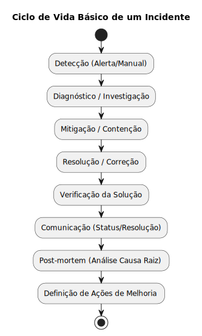

# 3. Plano de Melhoria da Confiabilidade e Percepção do Cliente

A confiabilidade e a percepção positiva do cliente são cruciais para o sucesso do VOEBEM. Este plano descreve as práticas de Engenharia de Confiabilidade de Sites (SRE - Site Reliability Engineering) que propomos para alcançar e manter altos níveis de serviço, alinhando a operação técnica com a experiência do cliente.

## 3.1 Monitoramento e Observabilidade

Uma estratégia robusta de monitoramento e observabilidade é fundamental para entender o comportamento do sistema, detectar problemas proativamente e garantir que as metas de negócio sejam atendidas. Propõe-se uma abordagem baseada nos três pilares da observabilidade: métricas, logs e traces.

*   **SLIs (Service Level Indicators) Chave:** Indicadores quantitativos que medem aspectos específicos do serviço. Exemplos para VOEBEM:

    | Categoria      | SLI (Indicador)                                                                 |
    | -------------- | ------------------------------------------------------------------------------- |
    | Disponibilidade| % de requisições bem-sucedidas (HTTP 2xx/3xx) na API Gateway (endpoints chave) |
    | Disponibilidade| % de requisições bem-sucedidas nas APIs (Reservas, Voos)                        |
    | Latência       | Tempo de resposta (p95, p99) para busca de voos na API Gateway                  |
    | Latência       | Tempo de resposta (p95) para criação de reserva na API de Reservas              |
    | Taxa de Erros  | % de requisições com erro (HTTP 5xx) nas APIs (Gateway, Reservas, Voos)         |
    | Taxa de Erros  | Taxa de falhas na integração com Sistema de Pagamentos                          |
    | Taxa de Erros  | Taxa de erros na publicação/consumo de mensagens (Sistema de Mensageria)        |
    | Saturação      | Uso de CPU/Memória dos containers                                               |
    | Saturação      | Uso de conexões do banco de dados                                               |
    | Saturação      | Profundidade da fila no Sistema de Mensageria                                   |

*   **SLOs (Service Level Objectives):** Metas claras e mensuráveis para os SLIs mais críticos, definindo o nível de serviço esperado. Exemplos:

    | SLI Referente                                | Exemplo de SLO (Meta)                               | Janela     |
    | -------------------------------------------- | --------------------------------------------------- | ---------- |
    | Disponibilidade API Gateway (Busca/Reserva)  | >= 99.9% de requisições bem-sucedidas             | Mensal     |
    | Latência Busca de Voos (p95)                 | < 800ms                                             | Contínua   |
    | Latência Criação de Reserva (p95)            | < 1500ms                                            | Contínua   |
    | Taxa de Erros API Reservas (5xx)             | < 0.1%                                              | Mensal     |

    *(Nota: Estes são exemplos iniciais e devem ser refinados com base em dados históricos e necessidades de negócio).*

*   **Ferramentas Propostas:**

    | Pilar          | Ferramenta(s) Proposta(s)                                  | Principal Responsabilidade                                      |
    | -------------- | ---------------------------------------------------------- | --------------------------------------------------------------- |
    | Métricas       | Prometheus + Grafana                                       | Coleta e Visualização de Métricas (SLIs, SLOs, Saúde)           |
    | Logs           | Fluentd/Bit + Loki + Grafana (ou ELK Stack)                | Coleta, Agregação e Consulta de Logs                            |
    | Tracing        | Jaeger + OpenTelemetry + Grafana                           | Coleta e Visualização de Traces Distribuídos                    |
    | Alertas        | Alertmanager + PagerDuty/Opsgenie                          | Definição de Regras de Alerta e Notificação On-Call             |

*   **Alertas:**
    *   Configurados no **Alertmanager** (parte do ecossistema Prometheus).
    *   Baseados principalmente na **violação dos SLOs** (Exemplo: taxa de erro acima do limite por X minutos, latência p99 excedendo o objetivo) ou em **sintomas críticos** (Exemplo: serviço indisponível, erro de acesso ao banco de dados, fila de mensagens crescendo rapidamente, certificados expirando).
    *   Alertas devem ser **acionáveis**, indicando claramente o problema e o impacto potencial.
    *   Direcionamento para a equipe de plantão (on-call) através de ferramentas como **PagerDuty** ou **Opsgenie**, com diferentes níveis de severidade e canais de notificação (Exemplo: chat, telefone).

## 3.2 Automação de Recuperação

Para aumentar a resiliência e reduzir a necessidade de intervenção manual em caso de falhas, propõe-se a implementação de mecanismos de recuperação automática, principalmente aproveitando recursos do Kubernetes e serviços gerenciados na nuvem.

*   **Auto-Healing (Kubernetes):**
    *   **Liveness Probes:** Verificações periódicas configuradas nos Deployments/StatefulSets. Se um container falhar na verificação (Exemplo: travado, não respondendo a um endpoint `/healthz`), o Kubelet o reiniciará automaticamente na mesma instância (Node).
    *   **Readiness Probes:** Verificações que indicam se um container está pronto para receber tráfego (Exemplo: aplicação iniciada, conexões estabelecidas). O Kubernetes só enviará tráfego (via Services) para Pods que estejam "Ready". Se um Pod falhar na Readiness Probe, ele é temporariamente removido do balanceamento de carga até se recuperar.
    *   **ReplicaSets/Deployments:** Garantem que o número desejado de réplicas de um serviço esteja sempre em execução. Se um Node falhar, os Pods que estavam nele são automaticamente reagendados em outros Nodes saudáveis.

*   **Auto-Scaling (Kubernetes):**
    *   **Horizontal Pod Autoscaler (HPA):** Ajusta automaticamente o número de réplicas de um Deployment/StatefulSet com base em métricas observadas, como utilização média de CPU, memória ou métricas customizadas (Exemplo: requisições por segundo, profundidade de fila via KEDA). Isso garante que o sistema tenha capacidade suficiente para lidar com picos de carga e reduza custos em períodos de baixa utilização.
    *   **Cluster Autoscaler (Provedor de Nuvem):** Adiciona ou remove automaticamente Nós (VMs) ao cluster Kubernetes com base na demanda por recursos (Pods pendentes por falta de CPU/memória).

*   **Failover Automático (Componentes Stateful):**
    *   **Banco de Dados Central (PostgreSQL):** Utilizar um serviço de banco de dados gerenciado na nuvem (Exemplo: AWS RDS, Google Cloud SQL, Azure Database for PostgreSQL) configurado em modo **Multi-AZ (Multi-Availability Zone)**. O provedor de nuvem gerencia a replicação síncrona para uma instância standby em outra AZ e realiza o failover automático para a standby em caso de falha da instância primária, com mínima interrupção.
    *   **Cache (Redis):** Utilizar um serviço gerenciado (Exemplo: AWS ElastiCache for Redis, Google Memorystore) com replicação e failover automático habilitados, se disponível e necessário para a criticidade dos dados em cache.

*   **Chaos Engineering (Prática Recomendada):**
    *   Após estabilizar o sistema e implementar as automações, introduzir falhas controladas periodicamente em ambientes de pré-produção (ou até mesmo produção, com cuidado) para validar a eficácia dos mecanismos de auto-healing, auto-scaling e failover.
    *   **Ferramentas:** Chaos Mesh (CNCF), LitmusChaos (CNCF), ou ferramentas específicas do provedor de nuvem.
    *   **Objetivo:** Descobrir fraquezas ocultas na resiliência do sistema antes que elas causem incidentes reais.

## 3.3 Gestão de Incidentes

Mesmo com automação, incidentes ocorrerão. Um processo claro e eficiente de gestão de incidentes é crucial para minimizar o impacto nos usuários e aprender com as falhas.

**Técnicas Chave para Redução de MTTD e MTTR:**

| Foco   | Técnica                     | Descrição/Objetivo                                                                 |
| ------ | --------------------------- | ---------------------------------------------------------------------------------- |
| MTTD   | Alertas Acionáveis          | Garantir que alertas sejam claros, relevantes e indiquem o impacto/causa.          |
| MTTD   | Dashboards Consolidados     | Visualizar rapidamente a saúde dos serviços, SLOs e métricas chave.                |
| MTTD   | Correlação (Métricas/Logs/Traces) | Usar ferramentas de observabilidade para conectar diferentes sinais rapidamente. |
| MTTR   | Runbooks/Playbooks          | Documentar procedimentos passo-a-passo para diagnóstico e mitigação.             |
| MTTR   | Escalas de Plantão (On-Call)| Definir responsabilidades claras e ferramentas de notificação eficientes.         |
| MTTR   | Ferramentas de Comunicação  | Usar canais dedicados (chat) para comunicação focada durante o incidente.         |
| MTTR   | Automação de Mitigação      | Automatizar ações de recuperação para incidentes bem compreendidos (opcional).    |
| MTTR   | Acesso e Permissões         | Garantir que a equipe on-call tenha o acesso necessário e seguro.                  |
| Ambos  | Post-mortems "Blameless"    | Analisar a causa raiz sistêmica e definir ações de melhoria para prevenir recorrência. |

**Ciclo de Vida Básico de um Incidente (Diagrama):**

*   **Redução de MTTD (Mean Time To Detect):**
    *   **Alertas Acionáveis:** Garantir que os alertas configurados (baseados em SLOs e sintomas) sejam claros, relevantes e direcionem para a possível causa ou impacto. Evitar ruído excessivo de alertas não acionáveis.
    *   **Dashboards Consolidados (Grafana):** Manter dashboards que mostrem rapidamente a saúde dos serviços principais, o status dos SLOs e métricas chave, facilitando a identificação visual de anomalias.
    *   **Correlação:** Utilizar as ferramentas de observabilidade (Grafana com Loki/Jaeger/Prometheus) para correlacionar rapidamente métricas, logs e traces durante a investigação inicial.

*   **Redução de MTTR (Mean Time To Recover):**
    *   **Runbooks/Playbooks:** Documentar procedimentos passo-a-passo para diagnosticar e mitigar incidentes comuns ou alertas específicos. Devem ser mantidos atualizados e facilmente acessíveis.
    *   **Escalas de Plantão (On-Call):** Definir escalas de plantão claras, com responsabilidades bem definidas e ferramentas adequadas (PagerDuty/Opsgenie) para notificação e escalonamento.
    *   **Ferramentas de Comunicação:** Utilizar canais dedicados em ferramentas de chat (Slack, Teams) para comunicação focada durante um incidente ("War Room" virtual).
    *   **Automação de Mitigação (Opcional):** Para incidentes muito bem compreendidos, automatizar ações de mitigação (Exemplo: reiniciar um serviço específico, escalar temporariamente um recurso) via scripts ou ferramentas de automação.
    *   **Acesso e Permissões:** Garantir que a equipe on-call tenha o acesso necessário e seguro para investigar e aplicar correções nos ambientes.
    *   **Cultura de Post-mortems "Blameless":**
        *   Realizar análises pós-incidente detalhadas para cada incidente significativo.
        *   Foco em entender a **causa raiz sistêmica** (tecnologia, processo, monitoramento) e não em culpar indivíduos.
        *   Documentar o incidente, a linha do tempo, o impacto, as ações tomadas e, principalmente, as **ações de acompanhamento** (melhorias no código, infraestrutura, monitoramento, runbooks) para prevenir recorrências.

## 3.4 Feedback dos Clientes

A percepção do cliente é a medida final da confiabilidade. Coletar e agir sobre o feedback do cliente é essencial para complementar os dados técnicos de monitoramento.

*   **Canais de Coleta:**

    | Canal                                    | Descrição / Exemplo                                                              |
    | ---------------------------------------- | -------------------------------------------------------------------------------- |
    | Pesquisas In-App/Web                     | Perguntas curtas sobre a experiência após ações chave (reserva, busca).          |
    | Formulários de Contato/Suporte           | Canal direto para reportar problemas ou dificuldades específicas.                |
    | Análise de Chamados de Suporte           | Categorizar e analisar os motivos dos contatos com a equipe de suporte.          |
    | Monitoramento de Redes Sociais/Avaliação | Acompanhar menções à VOEBEM em plataformas públicas (Twitter, Reclame Aqui).     |
    | Pesquisas de Satisfação (NPS/CSAT)       | Medir a satisfação geral e a probabilidade de recomendação periodicamente.       |

*   **Processamento e Ação:**

    **Fluxo Básico de Tratamento de Feedback (Diagrama):**

    

    *   **Centralização:** Agregar o feedback de diferentes canais em uma ferramenta ou processo unificado (Exemplo: um quadro Kanban, uma ferramenta de gestão de feedback).
    *   **Análise e Categorização:** Identificar temas recorrentes, problemas específicos, sugestões de melhoria. Correlacionar reclamações (Exemplo: lentidão) com dados de monitoramento técnico.
    *   **Priorização:** Avaliar o impacto e a frequência dos problemas reportados pelos clientes.
    *   **Integração com Backlog:** Transformar feedback acionável em itens de trabalho (bugs, melhorias) para as equipes de desenvolvimento e SRE.
    *   **Refinamento de SLIs/SLOs:** Usar o feedback para validar se os SLIs/SLOs atuais refletem a experiência real do usuário ou se novos indicadores são necessários (Exemplo: sucesso na conclusão do fluxo de reserva ponta-a-ponta).
    *   **Comunicação (Fechamento do Loop):** Informar aos clientes (quando apropriado e possível) sobre as ações tomadas com base em seus feedbacks, demonstrando que a empresa ouve e age.
